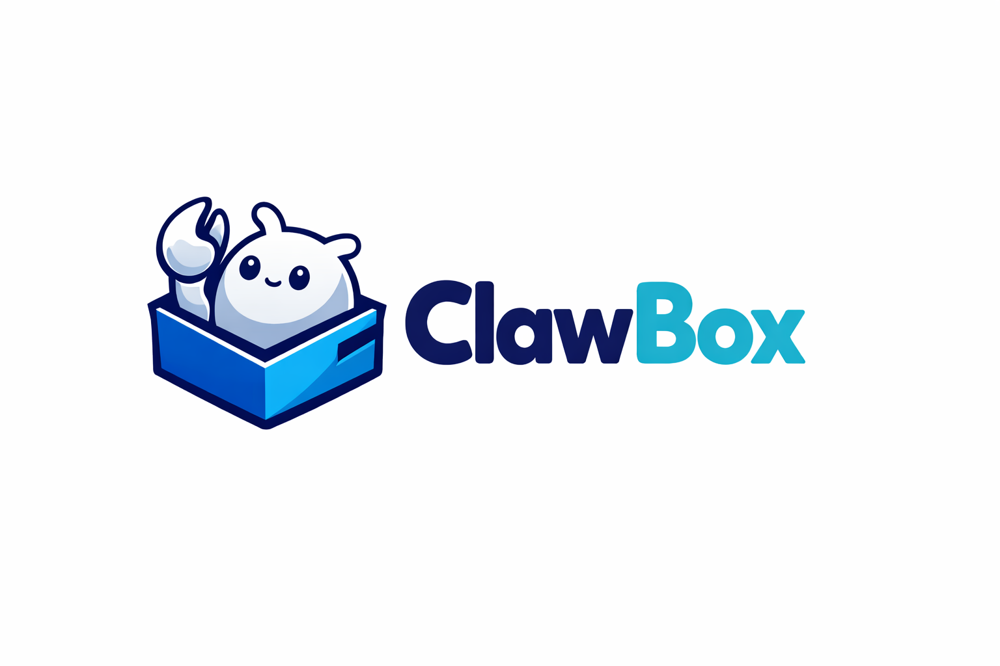

<p align="center">
  ClawBox is a desktop client for the <a href="https://github.com/openclaw/openclaw">OpenClaw</a> Gateway. It packages a Tauri shell, a React frontend, and a Bun/Hono backend into a single desktop workflow for chat, sessions, channels, cron, skills, and onboarding.
</p>

<p align="center">
  <a href="https://github.com/CommonstackAI/clawbox"><strong>GitHub</strong></a>
  &nbsp;&nbsp;•&nbsp;&nbsp;
  <a href="https://github.com/CommonstackAI/clawbox/releases"><strong>Releases</strong></a>
  &nbsp;&nbsp;•&nbsp;&nbsp;
  <a href="https://github.com/CommonstackAI/clawbox/issues"><strong>Issues</strong></a>
  &nbsp;&nbsp;•&nbsp;&nbsp;
  <a href="https://github.com/openclaw/openclaw"><strong>OpenClaw</strong></a>
  &nbsp;&nbsp;•&nbsp;&nbsp;
  <a href="./README.zh.md"><strong>中文</strong></a>
</p>

<hr />

## Install And Use

If you only want to use ClawBox, start here instead of the development setup below.

### 1. Download the desktop app

- macOS / Windows: download the latest package from [GitHub Releases](https://github.com/CommonstackAI/clawbox/releases)
- Linux: source build only for now

### 2. Launch ClawBox and choose an environment mode

On first launch, ClawBox opens a setup wizard and helps you prepare the OpenClaw runtime.

- `Portable (Built-in)`: recommended for most users. ClawBox prepares an app-managed portable Node.js runtime and installs OpenClaw for you during setup.
- `System Install`: use this if you already manage OpenClaw yourself on the machine.

If you choose `System Install`, install OpenClaw first:

```bash
npm install -g openclaw@latest
```

### 3. Let the setup wizard finish

The wizard will check the OpenClaw runtime, start the Gateway, and guide you into the app.

- Recommended baseline: OpenClaw `2026.3.12` or newer
- Default Gateway URL shape: `http://127.0.0.1:18789/v1`

If you already run OpenClaw elsewhere, open ClawBox settings and point it at your existing Gateway URL.

### 4. Configure your model provider

After setup finishes, open **Settings** and configure an upstream provider:

- `CommonStack`: recommended project-default path
- `Custom Provider`: supports OpenAI-compatible or Anthropic-compatible endpoints

Then save the provider config, fetch models if needed, and choose a default model.

### 5. Start using ClawBox

Once the Gateway and provider are ready, you can:

- start chats and manage sessions
- edit Soul files
- manage channels, cron jobs, plugins, and skills

## Scope

- ClawBox is open source in this repository.
- OpenClaw is a separate dependency and is **not bundled** here.
- For the least friction, use OpenClaw `2026.3.12` or newer.

## Tech Stack

- Tauri v2 shell in [`src-tauri/`](src-tauri)
- Bun/Hono backend in [`internal/`](internal)
- React 18 + Vite frontend in [`src/`](src)

## Development Quick Start

If you are contributing to ClawBox or running it from source, use this flow.

### 1. Install dependencies

```bash
npm ci
```

### 2. Install and start OpenClaw

```bash
npm install -g openclaw@latest
openclaw gateway run --dev --auth none --bind loopback --port 18789
```

If you already run OpenClaw elsewhere, point ClawBox at that Gateway URL in settings or via `OPENCLAW_GATEWAY_URL`.

### 3. Start ClawBox

Frontend + backend:

```bash
npm run dev
```

Desktop app:

```bash
npm run tauri:dev
```

## Installation Matrix

| Platform | Install path |
| --- | --- |
| macOS | GitHub Releases artifact or source build |
| Windows | GitHub Releases artifact or source build |
| Linux | Source build only for now |

Release and signing details live in [`docs/releasing.md`](docs/releasing.md).

### macOS Gatekeeper note

The public GitHub Releases workflow currently publishes macOS `.dmg` artifacts without Apple notarization. Because of that, macOS may show a message such as "ClawBox is damaged and can't be opened" on first launch even when the download itself is intact.

If you trust the release artifact you downloaded from this repository, move `ClawBox.app` to `/Applications` first, then remove the quarantine flag:

```bash
xattr -dr com.apple.quarantine /Applications/ClawBox.app
```

Notes:

- Only do this for builds you downloaded from the official GitHub Releases page for this repository.
- If you prefer not to bypass Gatekeeper, build ClawBox from source instead.
- Once macOS signing and notarization are configured for public releases, this workaround should no longer be necessary.

## Build And Verification

```bash
npm run build:frontend
npm run build:backend
cargo check --manifest-path src-tauri/Cargo.toml
```

Repository hygiene:

```bash
npm run scan:repo
npm run audit:licenses
npm run audit:deps
```

Lightweight smoke test without a real OpenClaw runtime:

```bash
npm run smoke:backend
```

## OpenClaw Compatibility

- Supported baseline: OpenClaw `>= 2026.3.12`
- Compatibility notes: [`docs/openclaw-compatibility.md`](docs/openclaw-compatibility.md)
- Mock gateway entrypoint: [`scripts/mock-gateway.mjs`](scripts/mock-gateway.mjs)

## Contributing

- Contribution guide: [`CONTRIBUTING.md`](CONTRIBUTING.md)
- Security policy: [`SECURITY.md`](SECURITY.md)
- Code of conduct: [`CODE_OF_CONDUCT.md`](CODE_OF_CONDUCT.md)
- Dependency policy: [`docs/dependency-policy.md`](docs/dependency-policy.md)

## Development Notes

- Frontend API requests go through the local backend on `http://127.0.0.1:13000`.
- The backend talks to OpenClaw over WebSocket RPC.
- User-facing text must stay in sync across:
  - [`src/locales/en/translation.json`](src/locales/en/translation.json)
  - [`src/locales/zh/translation.json`](src/locales/zh/translation.json)

## Support Boundary

- ClawBox issues belong in this repository when the desktop shell, frontend, backend bridge, onboarding UI, or packaging logic is wrong.
- Pure Gateway protocol bugs, channel runtime bugs, or OpenClaw daemon behavior should be reported to OpenClaw unless ClawBox is clearly the layer breaking the contract.
- Issues and pull requests are triaged on a best-effort basis. Maintainers may redirect upstream-only problems to OpenClaw.

## Environment Overrides

Copy from [`.env.example`](.env.example) or set variables manually:

- `OPENCLAW_GATEWAY_URL`
- `OPENCLAW_GATEWAY_TOKEN`
- `CLAWBOX_HOME`
- `CLAWBOX_BACKEND_PORT`

## License

MIT. See [`LICENSE`](LICENSE).
